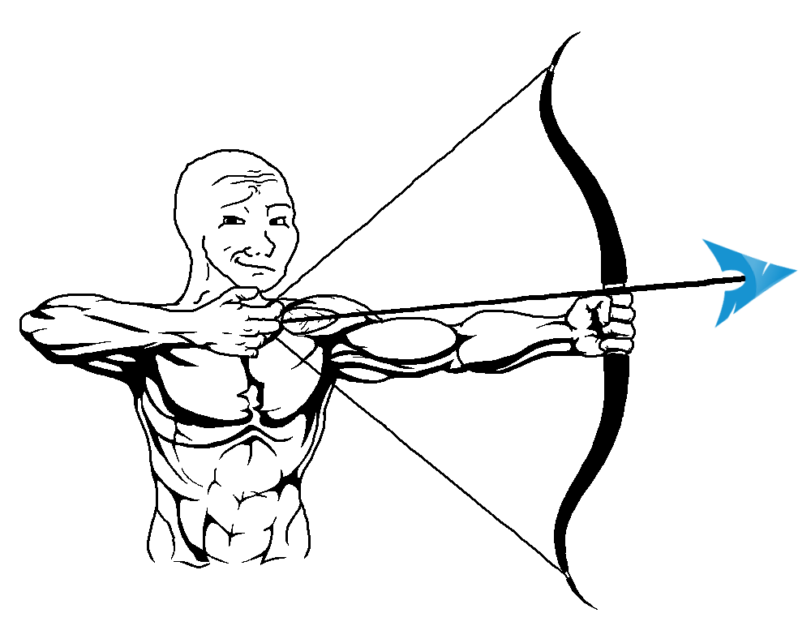

# things

## [icarus](projects/icarus/icarus.md): custom archiso profile for CTF players

<!-- <div align="center"> -->
<p>
    
</p>
<!-- </div> -->

### features

- [WIP]

## [archer](projects/archer/archer.md): automated arch linux install script


<div align="center">
<p>
    <!--  -->
</p>
</div>


### features

- menu based installer
- hardware detection
- pacman mirror ranking
- desktop environment / window manager selection
- netcache : use an already existing arch install to speed up the installation
- archstrike repository
- add additional packages to the install (aur supported)
- minimal install
- atomatic basic configuration (journald, coredump)

### usage

run the following command on the live iso
```bash
curl -s roliboy.ml/archer | bash
```

## [rootcow](projects/rootcow/rootcow.md): read-only write privilege escalation using CVE-2016-5195

- *usage*

## [turbofuck](projects/turbofuck/turbofuck.md): optimizing brainfuck compiler

- *list of features*
- *benchmark thingies and usage example*

## [ansify](projects/ansify/ansify.md): image to ansi rgb escape sequence converter


## [raytracer](projects/raytracer/raytracer.md)

- *link to pdfs*
- *screenshots*
- *features*

## [linuwux](projects/linuwux/linuwux.md)

*...*

# writeups

- [defcamp 2020 : qr-mania](writeups/defcamp2020-qr-mania/defcamp2020-qr-mania.md)
- [unbreakable romania online 1 : russiandoll](writeups/unbreakableromaniaonline1-russiandoll/unbreakableromaniaonline1-russiandoll.md)
- [pwnable.xyz : welcome](writeups/pwnablexyz-welcome/pwnablexyz-welcome.md)
- [pwnable.xyz : sub](writeups/pwnablexyz-sub/pwnablexyz-sub.md)

# contacts

- [github](https://github.com/roliboy/)
