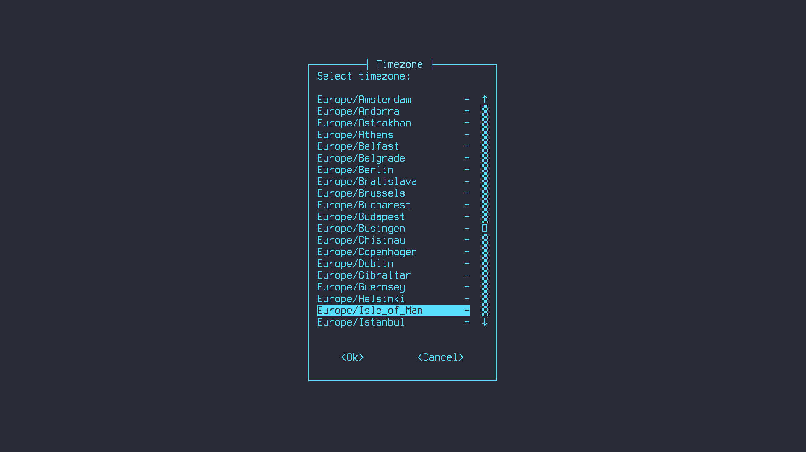
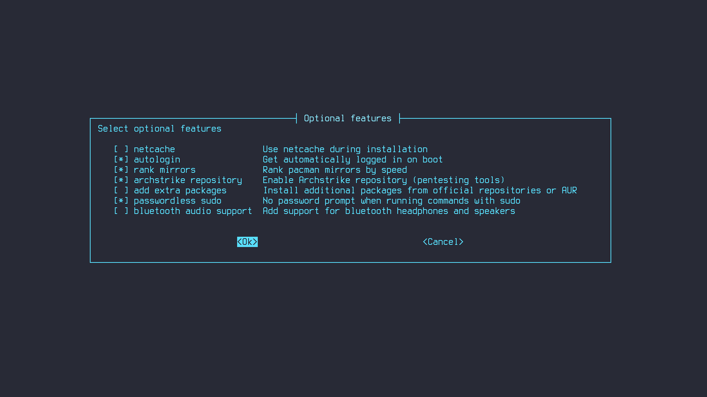
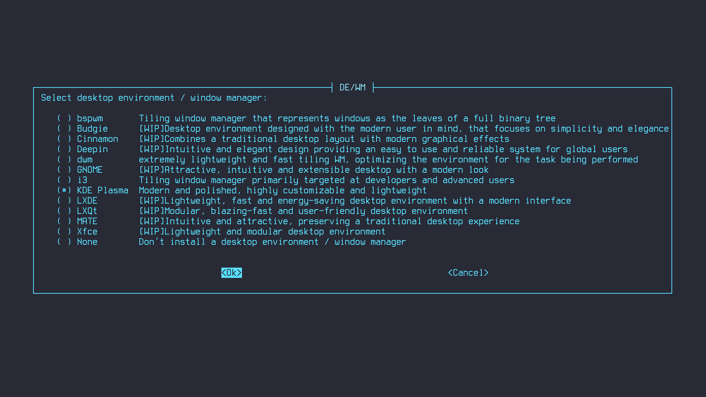
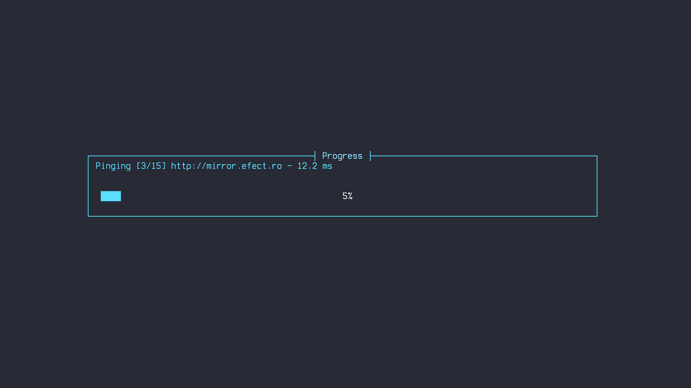
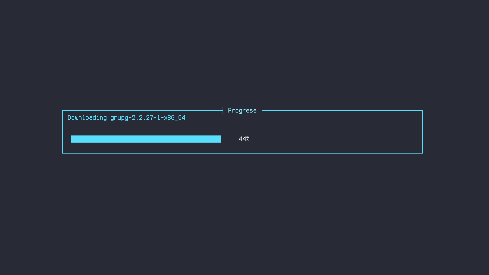

# archer

Automated Arch Linux install script for brainlets

## anon what do

- download arch
- burn arch
- boot arch
- `curl -s roliboy.ml/archer | bash`
- done

disclaimer: it will nuke your entire drive

## additional steps

- pray to /g/ everything is working

## requirements

- internet connection
- at least three brain cells

## my internet speed sucks but i alrady use arch btw

run another suspicious script **as root**, this time on your existing arch machine

```bash
curl -s roliboy.ml/netcache | sudo bash
```

and on the new system tick the use netcache box on the additional features dialog
you will be asked to enter the ip address of the machine on which the netcache script is running

## features

- menu based TUI installer
- hardware detection
- - boot mode (bios/uefi) : for bootloader
- - cpu (intel/amd) : for microcode
- - gpu (intel/amd/nvidia/nvidia optimus) : for graphics driver
- - battery : for tlp and battery life optimization
- - wireless : for tlp-rdw and more battery life optimization
- - bluetooth : for drivers and optional bluetooth headphone support
- - ssd : for trimming
- pacman mirror ranking [wip, only ping based ranking for now]
- desktop environment / window manager selection
- user creation with custom login shell
- multiple backends for nvidia optimus
- netcache : use an already existing arch install to speed up the installation
- archstrike repository
- add additional packages to the install (aur supported)
- minimal base install
- atomatic basic configuration (pacman, tlp, journald, coredump)

## screenshots
timezone selection


shell selection


optional features selection


desktop environment selection


mirrorlist ranking


installation


## setup for testing

packages required
- qemu
- edk2-ovmf

makefile targets
- `make all`: makes targets `archer` and `netcache`
- `make archer`: concatenates individual source files into a single bash script
- `make netcache`: creates netcache script
- `make test`: starts a qemu virtual machine with the official arch iso
- `make boot`: starts a qemu virtual machine booting from virtual disk image
- `make setup`: downloads official arch iso and creates virtual disk image
- `make clean`: removes the created scripts
- `make purge`: removes the downloaded arch iso and the created disk image

the guest machine can also be accessed through ssh on port 10022

```bash
ssh -p 10022 root@localhost
```
