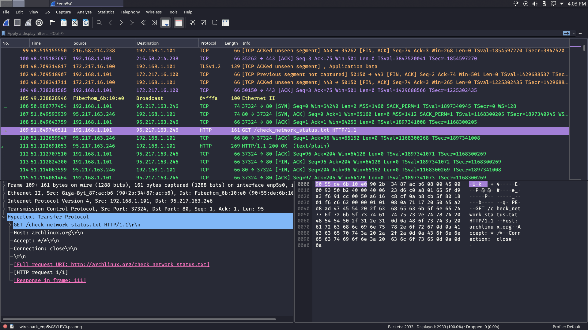

<h1>Archiso profile for CTF players</h1>
<!-- <h1>linux distro for CTF players</h1> -->
<a href="./packages.html">package list</a>
|
<a href="./shortcuts.html">keyboard shortcuts</a>
|
<a href="./screenshots.html">screenshots gallery</a>
|
<a href="./downloads.html">iso downloads</a>

## screenshots [WIP]

### custom wireshark color scheme

### custom cutter color scheme

### two instances of konsole
