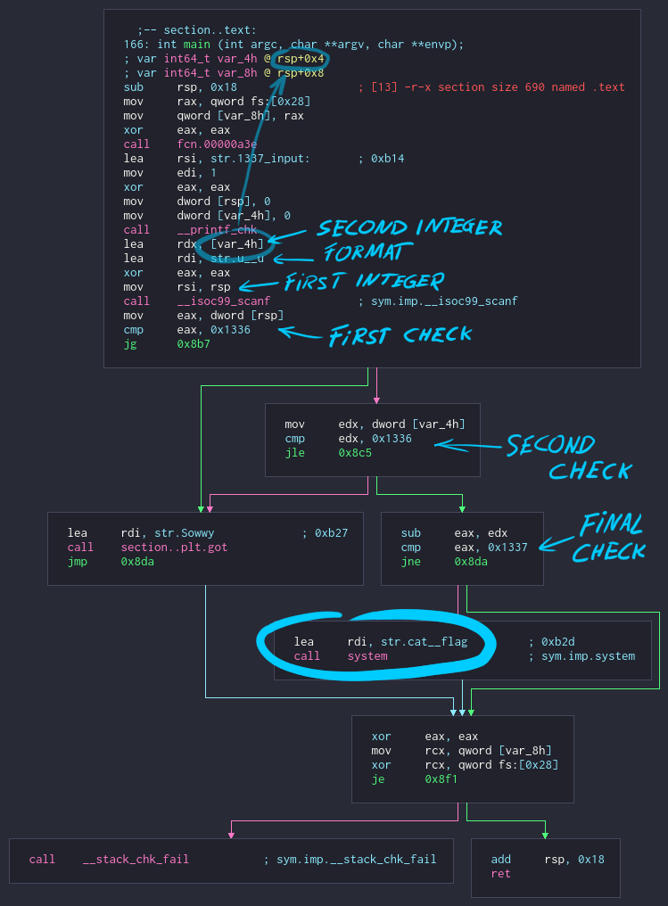

# [pwnable.xyz](https://pwnable.xyz/challenges/) : sub

**Category:** [pwn, reversing]

**Points:** 50 (fixed)

**Solves:** 928 (at the time of writing)

**Difficulty:** easy

**Description:**

> Do you know basic math?
>
> svc.pwnable.xyz : 30001

**Files:**

- [challenge](https://pwnable.xyz/redisfiles/challenge_22.gz)

---

## writeup

### initial run

when the binary is run, it prints `1337 input:` and waits for input

```plaintext
$ ./challenge
1337 input: hello?
```

passing it `hello?` did nothing

let's see what the read function expects:


the format string seems to be `%u %u`, so it reads two unsigned integers

```plaintext
$ ./challenge
1337 input: 69 420
```

still no output

### function graph

let's take a look at the main function in cutter:



it is pretty simple. it reads two integers, does some checks and eventually reaches the `system("cat flag")` call

after reading the integers, it checks if the first value is greater than `0x1336`. since we want to get to the `system` call, this check needs to fail, so we have to provide a value less than or equal to `0x1336` to proceed to the next check

in the second check, the second number is compared against `0x1336`. this time we want the jump to be executed, so the provided number will have to be, same as before, less than or equal to `0x1336`

before the last check, the second number is subtracted from the first one, and the resulting difference is compared with `0x1337`. if it is equal to `0x1337`, the `system("cat flag")` call is executed and we obtain the flag

so...

```plaintext
n1 <= 0x1336
n2 <= 0x1336
n1 - n2 == 0x1337
```

but the application reads two unsigned integers, how is that possible?

### looking for things that could go wrong

searching `c scanf format` on google returned a wikipedia page with a list of all valid format sequences with a short explanation

here's the part that concerns us:

```plaintext
%u : Scan for decimal unsigned int
(Note that in the C99 standard the input value minus sign is optional, so if a minus sign is read,
no errors will arise and the result will be the two's complement of a negative number,
likely a very large value.
```

passing a negative number as input will result in "a very large value", but "a very large value" is probably larger than `0x1336` and it will fail the check, right?

### signed and unsigned comparisons at instruction level

there are two sets of instructions for inequality operators:

signed:
- `>`: `jg` (jump if greater)
- `>=`: `jge` (jump if greater or equal)
- `<`: `jl` (jump if less)
- `<=`: `jle` (jump if less or equal)

unsigned:
- `>`: `ja` (jump if above)
- `>=`: `jae` (jump if above or equal)
- `<`: `jb` (jump if below)
- `<=`: `jbe` (jump if below or equal)

both checks in the program use a signed comparison instruction, so for all intents and purposes, the "very large values", still act like negative numbers

### obtaining the flag

```plaintext
let n1 = k, with k < 0`
and n2 = k - 0x1337
then
n1 - n2 = k - (k - 0x1337) = 0x1337
```

let's try it out for an arbitrary value of k

```plaintext
1337 input: -420 -5339
FLAG{sub_neg_==_add}
```
