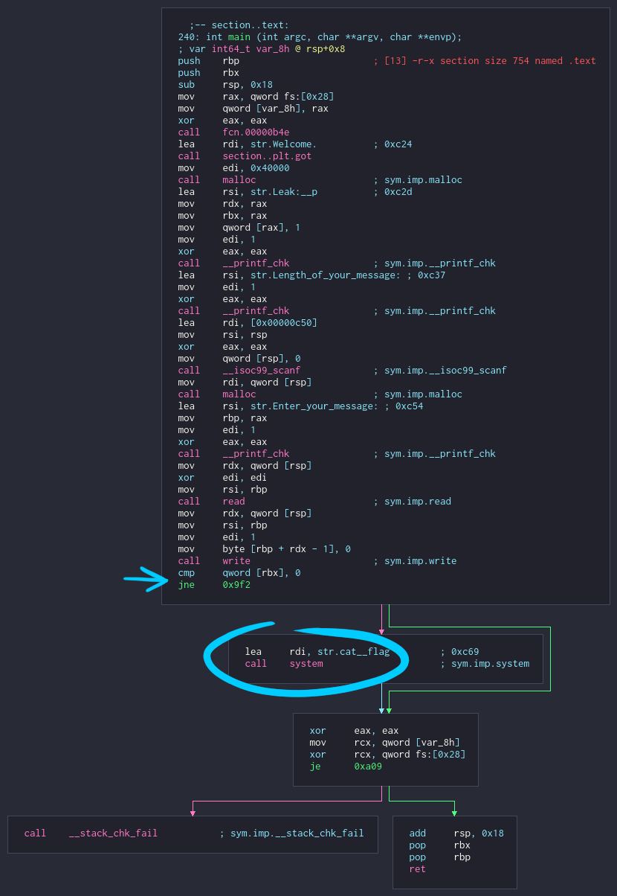
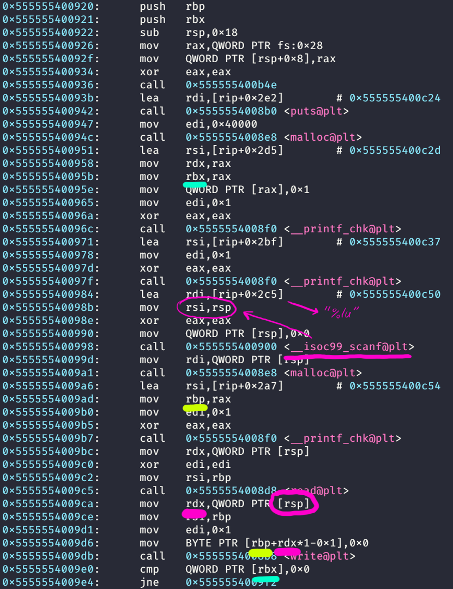

# [pwnable.xyz](https://pwnable.xyz/challenges/) : welcome

**Category:** [pwn, reversing]

**Points:** 50 (fixed)

**Solves:** 901 (at the time of writing)

**Difficulty:** easy

**Description:**

> Are you worthy to continue?
>
> svc.pwnable.xyz : 30000

**Files:**

- [challenge](https://pwnable.xyz/redisfiles/challenge_21.gz)

---

## writeup

### test run and function graph

```plaintext
$ ./challenge
Welcome.
Leak: 0x7f05f4b73010
Length of your message: 420
Enter your message: hello
hello
```

when executing the binary, it prints an address, reads a message length and the message and prints the read message

let's see what the main function looks like, using cutter:



there's the part that we want to reach: `system("cat flag")`

to execute it, the value stored at address `rbx` should be `0`. if it's not euql to zero, `jne` will jump over the `system` call

### understanding the function



main parts of the function:
- allocates a chunk of memory with malloc
- prints the address of the allocated memory
- reads a number
- allocates that many bytes
- reads that many characters into the newly allocated buffer
- sets the last character of the buffer to null

at first, it's not entirely obvious what needs to be done

the only place where `rbx` is modified is after the first `malloc`. it gets assigned the return value of the `malloc` call (from `rax`), but we don't have control over that

we could overwrite the value at `rbx` with zero if we can get the expression two lines before the check, `rbp+rdx*1-0x1` to be equal with `rbx`

let's see what values `rbp` and `rdx` hold, and whether we can control them

`rbp` gets assigned the return value of the second `malloc`. we have control over the size of the memory allocated, but the returned value is a "random" address decided by the kernel

`rdx` gets assigned a value from the stack (`rsp`), but the same `rsp` is passed as the second argument to `scanf`, which stores in it the integer value we provide as input

seems like we can only control `rdx`

### c and the footguns

```c
char* buffer = (char*)malloc(sizeof(char) * buffer_length);
strcpy(buffer, "error checking? we don't do that here");
```

if you're a c programmer you probably did this many times

but did you know that there's a chance of this happening?

```plaintext
Segmentation fault (core dumped)
```

from `man 3 malloc`:

```plaintext
The malloc() and calloc() functions return a pointer to the
allocated memory, which is suitably aligned for any built-in

type. On error, these functions return NULL.
```

which means with a big enough requested memory size, we can get the second `malloc` to fail and set `rbp` to zero

### obtaining the flag

`rbx` = `rbp` + `rdx` - 1

so we can directly control `rdx` with our input, and `rbp` becomes zero if the value is big enough

`rbp` + `rdx` = `rbx` + 1

the input needs to be the leaked address plus one. for a typical heap address (somewhere around 128 terabytes) it is safe to assume that `malloc` will fail and `rbp` becomes zero

```plaintext
Welcome.
Leak: 0x7f1e1b3de010
Length of your message: 139767282786321
Enter your message: get pwned
FLAG{did_you_really_need_a_script_to_solve_this_one?}
```
